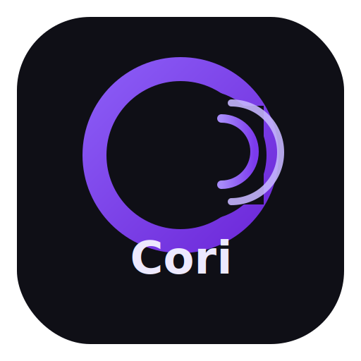

# Cori

Asistente por **voz** para **Windows** con interfaz en PyQt6: reconoce órdenes en español, muestra un overlay cuando escucha y ejecuta acciones (abrir apps y URLs, volumen, atajos de teclado, mensajes de voz, etc.).

## Logo



## Requisitos

- **Windows** (el control del volumen y muchos atajos están pensados para este sistema).
- **Python 3.10** o superior (recomendado; compatible con PyQt6).
- **Micrófono** y permisos de micrófono en Windows.
- Para el motor **Google**: conexión a **Internet** durante el reconocimiento.
- Para **Vosk** (reconocimiento local): descarga de un modelo de voz desde [alphacephei.com/vosk/models](https://alphacephei.com/vosk/models) y ruta configurada en `config.json`.

## Instalación

1. Clona o descarga este repositorio y entra en la carpeta del proyecto.

2. Crea un entorno virtual (recomendado):

```bash
python -m venv .venv
.venv\Scripts\activate
```

3. Instala dependencias con versiones fijas:

```bash
pip install -r requirements.txt
```

**Nota:** En Windows, `PyAudio` a veces exige un wheel compatible con tu versión de Python. Si `pip install` falla, instala el paquete adecuado desde [https://www.lfd.uci.edu/~gohlke/pythonlibs/#pyaudio](https://www.lfd.uci.edu/~gohlke/pythonlibs/#pyaudio) o usa una versión de Python para la que exista wheel oficial.

## Configuración

El archivo `config.json` **no** se versiona (está en `.gitignore`). Copia el ejemplo y adáptalo:

```bash
copy config.ejemplo.json config.json
```

Ahí puedes definir, entre otras cosas:

| Campo | Descripción |
|--------|-------------|
| `motor_reconocimiento` | `google` (Internet) o `vosk` (local). |
| `ruta_modelo_vosk` | Carpeta del modelo Vosk descomprimido (solo si usas `vosk`). |
| `idioma_reconocimiento` | P. ej. `es-ES`. |
| `url_musica` | URL para el comando de música. |
| `aplicaciones` / `urls` | Nombres que dirás y comando o URL. |
| `modo_programador` | Lista de programas a abrir con ese comando. |
| `navegador_procesos_cerrar` | Procesos a cerrar con «cierra navegador». |

Mucha personalización (mensajes, apps, URLs, plantillas de hora/fecha) también se puede hacer desde la pestaña **Personalizar** dentro de la aplicación; al guardar se actualiza `config.json`.

## Uso

Ejecuta la aplicación principal:

```bash
python cori_app.py
```

1. Abre la pestaña **Uso** y pulsa **Iniciar escucha**.
2. Di la palabra **Cori** en la misma frase que la orden, o primero «Cori» y luego la orden cuando aparezca la barra morada.
3. Para parar: di **para de escuchar** o usa **Detener escucha**.

La pestaña **Presentación** resume comandos y ejemplos.

## ¿Qué puede hacer Cori hasta el momento?

- Iniciar y detener la escucha por voz con activación por palabra clave (**Cori**).
- Abrir aplicaciones de Windows por nombre (por ejemplo: `notepad`, `msedge`, `cursor`, `spotify`).
- Abrir sitios web configurados en `config.json` (por ejemplo: YouTube, Netflix, Twitch).
- Controlar volumen del sistema: subir, bajar, silenciar y fijar porcentaje (por ejemplo, "volumen a 50").
- Ejecutar atajos de teclado de Windows:
	- copiar (`Ctrl + C`)
	- pegar (`Ctrl + V`)
	- deshacer (`Ctrl + Z`)
	- rehacer (`Ctrl + Y`)
	- mostrar escritorio (`Win + D`)
	- explorador de archivos (`Win + E`)
	- bloqueo de pantalla (`Win + L`)
	- recorte de pantalla (`Win + Shift + S`)
	- cambiar ventana (`Alt + Tab`)
- Control rápido de YouTube con tecla `K` (play/pausa) si el navegador tiene foco.
- Cerrar navegador por proceso (`msedge.exe`, `chrome.exe`, configurable).
- Activar "modo programador" para abrir un grupo de herramientas definidas en configuración.
- Responder con mensajes personalizables y opcionalmente hablados (TTS con `pyttsx3`).
- Decir hora y fecha en voz con plantillas configurables.
- Editar personalización desde interfaz gráfica (mensajes, frases, apps, URLs, plantillas).
- Funcionar con dos motores de reconocimiento:
	- **Google Speech Recognition** (requiere Internet).
	- **Vosk** (reconocimiento local sin Internet para transcripción).

## Demos opcionales

- `python demo_overlay.py` — prueba del overlay de mensajes.
- `python demo_tema.py` — vista previa del tema visual.

## Estructura del proyecto

| Ruta | Rol |
|------|-----|
| `cori_app.py` | Punto de entrada y ventana principal. |
| `cori/` | Lógica: escucha, comandos, overlay, tema, voz, teclas Windows, etc. |
| `config.ejemplo.json` | Plantilla de configuración. |
| `requirements.txt` | Dependencias Python con versión fija. |
